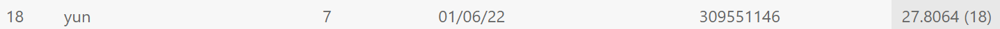

# VRDL HW4 - Image Super Resolution

## Deadline is 2022/01/13 23:59

## Introduction

Image superresolution is a task that restore image from low resolution. It can use in surveillance, medical, media, and ...etc. In medical, capturing high-resolution MRI images can be tricky, so deep learning can use to get better resolution image and less time. Same in media, we can transport low media low-resolution frames but enjoy high-resolution video.

## Installation

```cmd
cd VRDL_HW4
pip install -r requirements.txt
```

```git bash
# In git bash
git clone https://github.com/cszn/KAIR.git
git clone https://github.com/JingyunLiang/SwinIR.git
```

## Train

```cmd
cd KAIR
python main_train_psnr.py --opt options/swinir/train_swinir_sr_classical.json
```

You should put high resolution train image into `KAIR\trainsets\trainH`, then you can start to train.  
Please down load the `train_swinir_sr_classical.json` by [link](https://drive.google.com/file/d/18_s6cgUi8R8JhTXt_pFgBbCtRK1DPOti/view?usp=sharing) and replace the `KAIR\options\swinir\train_swinir_sr_classical.json`.

## Eval

```cmd
cd KAIR
python main_test_swinir.py --task classical_sr --scale 3 --training_patch_size 48 --model_path <model path> --folder_gt <high resolution test data folder>
```

High resolution test data folder default is setting as `KAIR\testsets\HW4_test\HR`, and low resolution test data will automatic produce by matlab bicublic, same as train.

Sample eval command:  

```cmd
python main_test_swinir.py --task classical_sr --scale 3 --training_patch_size 48 --model_path superresolution/swinir_sr_classical_patch48_x3/models/61500_G.pth --folder_lq testsets/HW4_test/LR_bicubic/X3 --folder_gt testsets/HW4_test/HR_sample
```

You can download model Weight in sample code and put it into dir `superresolution/swinir_sr_classical_patch48_x3/models` to run sample eval code.

## Methodology

### Data pre-process

Only need to provide HR image , and corresponding LR image will produce automatically with matlab bicublic.

### Model architecture

Please reference "SwinIR: Image Restoration Using Swin Transformer"[3] to know the whole model detail.

### Hyperparameters

Optimizer: Adam  
Optimizer lr: 2e-4  
Loss: L1

## Result

Final score of PSNR is 27.8064.

The baseline performance with VDSR[5] in PSNR is 27.4162.

## Summary

In this homework, I use SwinIR as my model and easy to train and to eval by command provide by KAIR. It only need to provide HR image and LR image will provide automatically for training and calculate PSNR for eval (test) image.

## Model Weights

Model Weights with PSNR 27.8064: <https://drive.google.com/file/d/1t825a76rK-E9zqpab5_Z5-hACedIqKhk/view?usp=sharing>

## Reference

[1] KAIR, <https://github.com/cszn/KAIR/blob/master/docs/README_SwinIR.md>  
[2] SwinIR, <https://github.com/jingyunliang/swinir>  
[3] "SwinIR: Image Restoration Using Swin Transformer", <https://arxiv.org/pdf/2108.10257v1.pdf>  
[4] "2021 VRDL HW4 Super Resolution", <https://codalab.lisn.upsaclay.fr/competitions/622?secret_key=4e06d660-cd84-429c-971b-79d15f78d400#results>  
[5] "VDSR, Kim etal. CVPR’16", <https://cv.snu.ac.kr/research/VDSR/VDSR_CVPR2016.pdf>  
[6] "Image Super-Resolution on paperwithcode.com", <https://paperswithcode.com/task/image-super-resolution>
